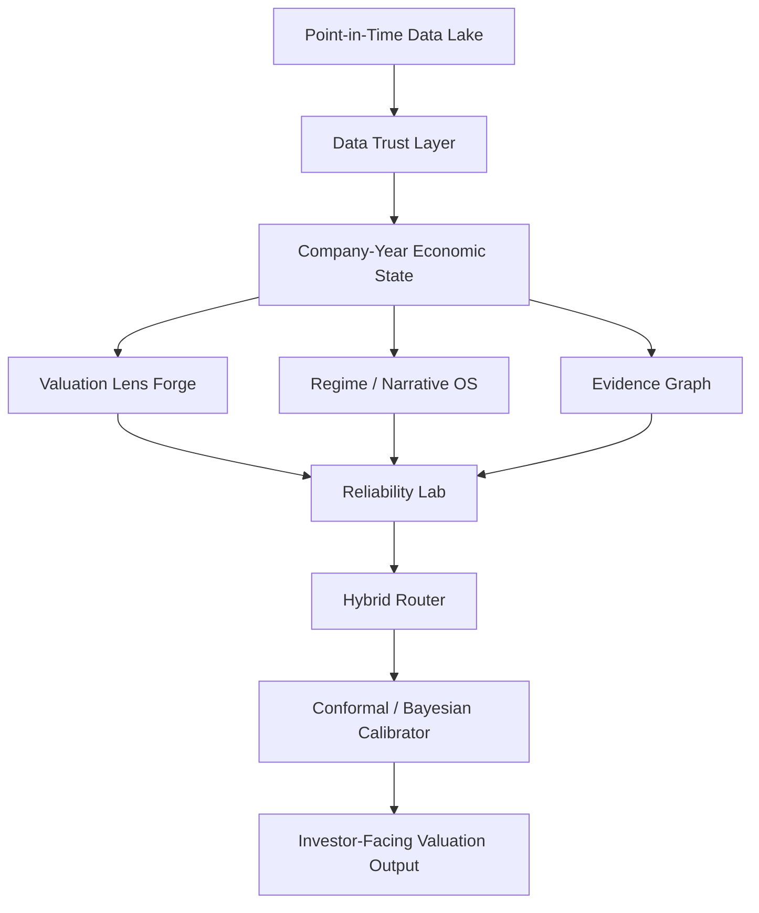

# AURORA Valuation Intelligence System

Date: 2026-06-27
Status: active architecture decision

Implementation status:

- First production cut landed locally in `lib/aurora-data-trust.js`, `lib/aurora-lens-forge.js`, `lib/valuation-router.js`, and `tests-node/aurora-router.test.mjs`.
- The current router is `aurora_router_v1`: deterministic prior only, learned residual disabled, neural artifacts shadow-only.
- The frontend valuation blend now has placeholder support for `ownerEarnings` and `capitalCycle` so AURORA weights do not disappear from the valuation calculation.
- Phase 1 Lens Audit landed locally in `lib/aurora-lens-audit.js` and `tests-node/aurora-lens-audit.test.mjs`: it ranks lenses by MAE/IC, cuts results by year/sector/regime, and creates high-conviction vs indeterminate labels.
- The Colab workflow is now wired in `VALUATION_OS_NEURAL_ROUTER_AURORA_AUDITED_KEYED_COLAB.ipynb`: it fixes stale/corrupt `^TNX` macro cache, exports `aurora_lens_audit_v1.json`, replaces mushy soft labels with AURORA regret/reliability labels, caches the assembled FMP panel, reuses/migrates the legacy `fmp_annual_panel_raw_v4.csv` panel when present, and blocks residual training when audit gates fail.
- The 2026-06-28 AURORA v2 notebook patch treats recurring `best epoch: 0` as a failed pre-training gate, not as a neural architecture problem. If labels are still too indeterminate or the uniform/train-mean label baselines are nearly identical, the notebook stops before the neural loop instead of wasting GPU and producing a misleading artifact.
- The follow-up AURORA label-factory patch replaces the brittle `indeterminateShare <= 45%` blocker with adaptive regret labels, sharper high-conviction target weights, low-weight indeterminate rows, and a pre-training gate based on usable training rows plus target sharpness.
- The local runner `scripts/run_aurora_router_local.py` now supersedes the Colab workflow for diagnostics. It builds a point-in-time FMP panel, uses filing/accepted-date availability instead of fiscal-date lookahead, splits train/validation before label audit, evaluates 1Y and 3Y horizons separately, and writes shadow artifacts under ignored `artifacts/aurora_router/`.
- Local run `20260628_024717` ingested 297 tickers / 2,901 rows with zero FMP errors. Both 1Y and 3Y remained `production_candidate=false`: ExtraTrees was the best challenger but did not beat uniform MAE/IC and collapsed practically into `unitEconomics`.
- Local fine-tuning run `20260628_104949` added rank-preserving bias calibration for each lens plus train-only blend tuning across model/train-mean/uniform weights. It still remained `production_candidate=false`. Useful finding: calibrated `assetValue` became the strongest 3Y single-lens MAE challenger, but the learned router still could not beat the relevant baselines without failing other gates.
- Local reliability-router run `20260628_111507` added train-only regime/sector/global lens reliability tables and stricter two-fold internal acceptance for specialized ridge lenses. The reliability router became the best 3Y router and beat uniform on 3Y MAE directionally, but still failed production gates because it did not beat the `assetValue` single lens, did not beat uniform IC, and lacked real high-confidence separation. The specialized ridge lenses were rejected for 3Y because they did not improve both 2019 and 2020 internal folds.
- Next step is running the audited Colab and using the exported audit report to decide whether Lens Forge v1 is differentiated enough or must be rebuilt before residual ML.

## Decision

Do not build another direct neural router as "V5".

The next system should be AURORA: an Audited, Uncertainty-aware, Regime-Oriented, Reliability-Adaptive valuation router.

The core product is not a black-box fair-value model. It is a valuation intelligence system that decides which valuation lenses deserve trust for a specific business at a specific point in time, how much weight each lens receives, when to abstain, and why.

## Why We Are Changing Direction

The V4 neural router failed the important gates:

- It lost to uniform and train-mean baselines.
- It had lower IC than uniform.
- Its high-confidence bucket was worse than uniform.
- It concentrated too much practical top-method selection in `reverseDcf`.
- Its labels were nearly uniform, so the model mostly learned indecision.
- It exposed a macro bug in the Colab ri[REDACTED_OPENAI_KEY] pipeline.
- It failed export because the scikit pipeline contained a non-pickleable lambda.

The problem was conceptual. V4 tried to learn:

> Given a company-year snapshot, predict weights across 8 valuation methods.

AURORA should learn:

> Given a business, its economic regime, data quality, valuation lens outputs, historical reliability in similar contexts, and current uncertainty, decide which valuation lenses deserve confidence, how much weight to assign, when to abstain, and how to explain the decision.

## Current Code Anchors

The repo already contains pieces that fit AURORA:

- `lib/valuation-router.js`: deterministic regime router v1. This should become the production prior, not be replaced by an unproven neural model.
- `app/valuation-os-lab/api/snapshot/route.js`: live snapshot + assumption policy. It already uses an official Treasury XML parser in tests; the notebook macro bug is separate and must be fixed there.
- `app/valuation-os-lab/api/debate/route.js`: multi-agent valuation committee. This can consume AURORA outputs as evidence.
- `lib/valuation-context-pack.js`: structured context packaging for agents.
- `lib/valuation-catalyst-pack.js` and `lib/valuation-catalyst-news.js`: qualitative/catalyst evidence. These should feed the regime/narrative layer.
- `lib/factorlab-engine.js`: point-in-time factor and thesis scoring. This can become part of the evidence/lens reliability layer.
- `docs/VALUATION_ROUTER_FRESH_AGENT_HANDOFF.md`: forensic diagnosis of the failed V4 notebook.

## AURORA Architecture



## Layer 0: Data Trust

No model should train on company-years that fail data sanity checks.

Each company-year should carry:

- `data_quality_score`: completeness, consistency, freshness, and outlier control.
- `accounting_quality_score`: accruals, working-capital anomalies, one-offs, goodwill, SBC, restatements.
- `macro_validity_score`: rates, inflation, FX, commodity sanity checks.
- `point_in_time_valid`: no leakage from data not available at the decision date.
- `feature_lineage`: source, as-of date, transform, and test.
- `do_not_train_reason`: explicit exclusion reason.

Immediate notebook repair:

- Fix ri[REDACTED_OPENAI_KEY] parsing. `^TNX` values should be treated as percentage points; `0.917` means `0.00917`, not `0.917`.
- Add hard sanity checks so 2020 cannot silently become `risk_free_10y = 0.12000`.
- Replace the export lambda with a named function or export only JSON preprocessing state.

## Layer 1: Valuation Lens Forge

The current Colab "methods" are proxy formulas. AURORA needs real lens outputs.

Each lens should emit a distribution, not just a score:

```text
LensOutput = {
  expected_return_1y,
  expected_return_3y,
  fair_value_base,
  fair_value_p10,
  fair_value_p90,
  downside_probability,
  upside_probability,
  confidence,
  fragility,
  assumptions,
  falsifiers
}
```

Initial lenses:

- DCF: normalized FCF, reinvestment, growth fade, WACC, terminal value, duration.
- ROIC fade: current ROIC, incremental ROIC, reinvestment runway, competitive erosion.
- Reverse DCF: growth, margin, and ROIC implied by the current market price.
- Residual income: book capital, ROE vs COE spread, clean surplus, financials suitability.
- Asset value: tangible book, replacement cost, NAV, liquidation/recovery value.
- Unit economics: contribution margin, cohort economics, LTV/CAC, payback, operating leverage.
- Bottleneck power: capacity, backlog, supply concentration, pricing power, switching costs.
- Real options: platform optionality, R&D, new market expansion, convexity.
- Relative quality comps: multiples adjusted for ROIC, growth, margin, leverage, durability.
- Owner earnings: normalized cash to owner, capital intensity, reinvestment needs, capital allocation.
- Capital cycle: supply response, industry capex, capacity additions, mean reversion.

The router cannot be better than its experts. Lens audit comes before neural training.

## Layer 2: Economic Regime Engine

Do not force each company-year into one class. Use a multi-label regime vector:

```text
regime = {
  quality_compounder,
  cyclical,
  financial,
  asset_heavy,
  pre_profit,
  bottleneck,
  regulated,
  turnaround,
  bubble_expectations,
  disrupted
}
```

This engine should combine:

- Rule-based regime prior: transparent economics.
- ML classifier: learned historical patterns.
- Text/narrative extractor: filings, calls, MD&A, transcripts, and catalyst evidence.

Text matters because ratios often miss the real reason a lens should dominate: capacity constraints, backlog normalization, AI demand visibility, regulatory capital, customer concentration, pricing actions, cohort retention, or inventory correction.

## Layer 3: Evidence Graph

AURORA should move beyond flat tabular features.

Represent each company as an economic graph:

```text
Company
  Products
  Segments
  Customers
  Suppliers
  Competitors
  Macro factors
  Commodity/rate/FX exposures
  Accounting policies
  Management claims
  Catalysts
  Falsifiers
```

This graph should feed both the regime engine and the investor-facing explanation.

## Layer 4: Label Factory

V4 labels were too mushy. AURORA should produce multiple training targets:

- High-conviction winner: only when one method beats the second-best by a real margin.
- Pairwise preference: method A beats method B in this context.
- Regret label: how much error each method would have avoided.
- Indeterminate label: no method clearly wins.
- Multi-horizon label: separate 1Y, 3Y, and eventually 5Y reliability.

If the margin between the best and second-best lens is not meaningful, the label should be `indeterminate`. The system must learn to say "no reliable method preference", not invent false precision.

## Layer 5: Hybrid Router

Production should be a hybrid:

```text
final_weights = normalize((1 - rho) * deterministic_prior + rho * learned_residual)
```

Where:

```text
rho = clip(
  signal_quality
  * data_quality
  * validation_stability
  * (1 - ood_risk),
  0,
  0.75
)
```

Implication:

- When evidence is strong and in-distribution, ML can adjust weights.
- When evidence is weak, stale, or out-of-distribution, AURORA falls back to the deterministic prior.
- The deterministic router is not a temporary scaffold. It is the safety rail.

## Layer 6: Model Tournament

Do not bet production on one model.

Candidate models:

- Deterministic router: mandatory explainable baseline.
- Multinomial logistic / elastic net: interpretable statistical baseline.
- CatBoost / LightGBM: strong tabular challenger.
- GAM / Explainable Boosting Machine: nonlinear but inspectable.
- Pairwise ranker: learns method-vs-method preferences.
- Mixture-of-experts router: natural fit for lens allocation.
- Tabular foundation model: challenger only, not default authority.
- Distilled MLP: deployment-friendly only if it beats stronger validation gates.

The neural router becomes a residual/challenger, not the core brain.

## Layer 7: Uncertainty And Abstention

AURORA output should include confidence and abstention:

```text
router_confidence: low | medium | high
valuation_dispersion: low | medium | high
ood_risk: low | medium | high
abstain_from_method_preference: true | false
```

Fair value should be a mixture of lens distributions:

```text
mu = sum(weight_k * mu_k)
variance = sum(weight_k * (sigma_k^2 + mu_k^2)) - mu^2
```

Use conformal or Bayesian calibration on top of the model stack. If high-confidence predictions do not outperform medium-confidence predictions, confidence is not real and the model cannot be promoted.

## Training Objective

Replace simple MAE with a composite objective:

```text
Loss =
  lambda_regret * L_regret
  + lambda_pairwise * L_pairwise
  + lambda_rank_ic * L_rankIC
  + lambda_calibration * L_calibration
  + lambda_entropy * L_entropy
  + lambda_stability * L_stability
```

Promotion metrics:

- Forecast MAE vs uniform, train mean, best-single lens, and deterministic router.
- Spearman IC by year.
- Regret avoided.
- High-confidence lift.
- Calibration error.
- Weight concentration / HHI.
- By-regime lift.
- OOD abstention quality.
- Recommendation drawdown.

## Validation Gates

Use rolling-origin validation:

- train <= 2016, validate 2017
- train <= 2017, validate 2018
- train <= 2018, validate 2019
- train <= 2019, validate 2020
- train <= 2020, validate 2021
- train <= 2021, validate 2022
- train <= 2022, validate 2023
- train <= 2023, validate 2024 when available

Required gates:

- Beats uniform in at least 70% of folds.
- Beats train mean in at least 70% of folds.
- Beats deterministic router in enough regimes to justify ML residual usage.
- IC is positive and above baseline in at least 70% of years.
- High-confidence bucket beats medium and low confidence.
- No method collapse.
- No hidden sector dependency.
- Data quality gates pass.
- Export is reproducible.
- Every material weight has an economic explanation.

## Investor-Facing Output

AURORA should produce an investment memo, not just weights.

Example shape:

```text
Company: XYZ
Router decision: Quality compounder with bottleneck optionality
Confidence: Medium-high
Primary lens: ROIC fade
Secondary lens: DCF
Tertiary lens: Reverse DCF

Weights:
  ROIC fade: 32%
  DCF: 26%
  Reverse DCF: 14%
  Bottleneck: 12%
  Owner earnings: 8%
  Real options: 5%
  Asset value: 2%
  Residual income: 1%

Fair value:
  Base: 118
  Bear: 76
  Bull: 174
  90% calibrated interval: 69-188

Why:
  - ROIC persistently above cost of capital.
  - Reinvestment runway remains positive.
  - Low leverage.
  - Reverse DCF shows current price already embeds moderate growth.
  - Asset value is low relevance because value is intangible / earnings-power driven.

Falsifiers:
  - Gross margin compression.
  - Incremental ROIC below historical levels.
  - Customer concentration worsening.
  - Pricing-power claims not visible in realized margins.
```

## Implementation Plan

### Phase 0: Repair

- Fix notebook macro bug.
- Remove lambda from preprocessing export.
- Add data quality gates.
- Rerun V4 as a forensic baseline only.

### Phase 1: Lens Audit

- Measure each current lens by year, sector, regime, and horizon.
- Report MAE, IC, directional accuracy, and regret.
- Stop ML training if lens forecasts are not distinct.
- Use `buildAuroraLensAudit(rows)` for the canonical audit contract.
- Use `buildAuroraLabelFactory(rows)` to create high-conviction, pairwise-ready, regret-weighted labels and preserve `indeterminate` cases.

### Phase 2: Lens Forge v1

- Replace proxy formulas with real lens engines.
- Emit distributions, assumptions, confidence, sensitivity, and falsifiers.

### Phase 3: Label Factory

- Build high-conviction, pairwise, regret, indeterminate, and multi-horizon labels.
- Keep low-conviction rows for calibration/abstention, not forced method labels.

### Phase 4: Deterministic Router v2

- Upgrade `lib/valuation-router.js` into the AURORA prior.
- Add data-quality-aware confidence and OOD behavior.
- Add explicit owner earnings and capital cycle lenses.

### Phase 5: Learned Residual

- Train ML only as residual over deterministic prior.
- Gate `rho` by evidence quality and out-of-distribution risk.

### Phase 6: Calibration

- Add conformal intervals or calibrated risk buckets.
- Make abstention first-class.

### Phase 7: Production Integration

- Expose AURORA output in `valuation-os-lab`.
- Feed output into debate agents and memo generation.
- Keep neural artifacts shadow-only until validation gates are met.

## Product Principle

Each valuation method is a different question:

- DCF: how much cash will this asset generate?
- ROIC fade: how long will excess returns persist?
- Reverse DCF: what expectations are already in the price?
- Residual income: how much value is created over book capital?
- Asset value: what are the assets worth if earnings are misleading?
- Unit economics: does the marginal unit create value?
- Bottleneck: is there monetizable structural scarcity?
- Real options: what is the value of future convexity?
- Owner earnings: how much real cash reaches the owner?
- Capital cycle: where are we in the supply response cycle?

The router should not merely predict returns. It should decide which question is the right question for this business now.

## Immediate Product Direction

Promote the deterministic router into the product backbone. Treat the neural router as a shadow model until it beats strict gates.

The next implementation move is Phase 0 repair plus Phase 1 lens audit. Do not train another neural router until the lens layer and label factory are credible.

## Local Fine-Tuning Pass - 2026-06-28

Local runner:

```text
scripts/run_aurora_router_local.py
```

Latest artifact:

```text
artifacts/aurora_router/20260628_112653
```

What changed:

- Added horizon-specific active lens sets.
- Kept `capitalCycle` active for 1Y tactical work.
- Removed `capitalCycle` from the active 3Y intrinsic router while keeping it as a diagnostic lens.
- Added `lens_portfolio`, a deterministic single/pair/equal-triple lens portfolio selected only on the train-end tune set.
- Reports now separate the train-selected best single lens from the validation-only diagnostic best lens.
- The runner can reuse an existing cached panel without requiring an FMP key, unless a panel rebuild is requested.

Latest results:

```text
1Y:
  best model: logistic
  production candidate: false
  uniform MAE: 0.2516
  logistic MAE: 0.2525
  logistic IC: 0.0996 vs uniform IC: 0.0698
  best validation diagnostic lens: capitalCycle, MAE 0.2466
  diagnosis: ranking signal improved, but MAE and method concentration gates fail.

3Y:
  best model: lens_portfolio
  production candidate: false
  active methods exclude capitalCycle
  uniform MAE: 0.1498
  train-selected best single lens: reverseDcf, MAE 0.1426
  validation diagnostic best lens: assetValue, MAE 0.1421
  lens_portfolio: 80% assetValue / 20% residualIncome
  lens_portfolio MAE: 0.1423
  diagnosis: credible shadow improvement over uniform/train-mean, but not over the best diagnostic single lens and still too concentrated for production.
```

Interpretation:

- The 1Y task is not ready for production routing. `capitalCycle` has useful validation MAE, but pre-2021 selection rules do not choose it robustly enough. Treat it as a tactical diagnostic signal, not a promoted router.
- The 3Y task now has a defensible shadow candidate: a simple intrinsic value portfolio dominated by `assetValue`, with `residualIncome` as a book-capital cross-check. This is much more economically coherent than the previous neural residual router.
- Strict gates are doing their job. The system is improving, but it should not mark a production candidate until it beats uniform, train mean, best single, IC, confidence, and concentration gates together.

Next line of attack:

1. Build a dedicated 1Y tactical/capital-cycle label rather than forcing the intrinsic-value objective onto 1Y.
2. Split product language: 1Y = tactical market setup, 3Y = intrinsic valuation.
3. Improve `assetValue` and `residualIncome` as real economic lenses instead of only router-tuning around proxy outputs.
4. Add sector/regime-level diagnostics for the 3Y `assetValue` edge to see whether it is broad or sector-dependent.
5. Keep neural models shadow-only until they beat the deterministic lens portfolio and best-single baselines.
